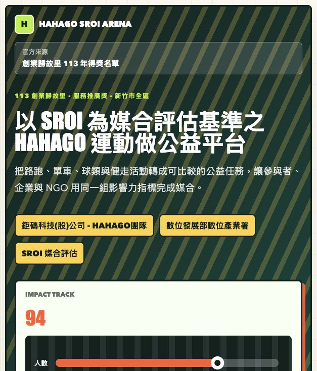
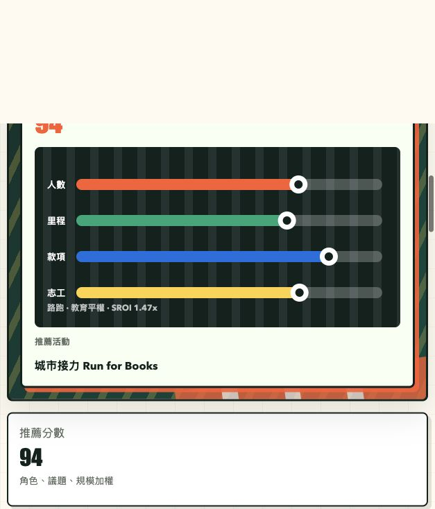

# HAHAGO SROI Sports For Good Platform

## 快速看懂

- 線上 Demo：https://atlasforcn.github.io/startup-hahago-sroi-sports/
- 這個原型在做什麼：把 HAHAGO 做成運動公益媒合與 SROI 影響力評估平台。
- 特色定位：特色是把公益活動媒合和社會投資報酬率放在同一個決策畫面。
- 操作流程：選擇企業、NGO 或活動需求 → 依參與人數與任務估算 SROI → 追蹤活動成果、公益影響與推薦配對

展開完整功能流程截圖

這個 repo 是依據 `鉅碼科技(股)公司 - HAHAGO團隊` 在 113 年創業歸故里得獎名單中的作品概念，製作出的前端互動 demo。原型把「運動做公益」理解為一個以 SROI（Social Return on Investment，社會投資報酬）作為媒合評估基準的平台，協助參與者、企業與 NGO 找到最適合的公益運動任務。

## 比賽來源

- 比賽/計畫：創業歸故里驗證輔導計畫
- 主辦/來源單位：數位發展部數位產業署
- 年度：113 年
- 屆次/階段：113 年得獎名單，官方頁面標示為「〖113創業歸故里創新創業競賽〗得獎名單(113/12/6公告)」
- 獎項：服務推廣獎
- 驗證場域：新竹市/新竹市全區
- 公司/團隊：鉅碼科技(股)公司 - HAHAGO團隊
- 作品：以 SROI 為媒合評估基準之HAHAGO運動做公益平台
- 官方來源：https://sccontest.tca.org.tw/content/display#sectionB

## 核心概念

HAHAGO 的概念可轉譯為「公益賽事媒合 + 影響力估算 + 成果追蹤」的服務平台。平台不只把運動活動推薦給使用者，也讓企業與 NGO 依照公益議題、參與規模、預期捐款、志工工時、健康促進與受益人數估算 SROI，作為媒合活動與資源投入的共同語言。

這個 demo 將核心流程拆成五個互動區塊：

- 運動公益活動媒合：依角色、公益目標與活動規模推薦路跑、單車、球類與健走公益活動。
- 參與者/企業/NGO 任務：切換三種角色，勾選各自要完成的賽前、賽中與賽後任務。
- SROI 指標估算：用贊助投入、人數、里程、志工時數與完成率即時計算估算值。
- 公益成果追蹤：追蹤里程、捐款、志工時數、受益人數與成果紀錄。
- 配對或推薦：顯示推薦分數、推薦理由與下一步任務，讓媒合結果可被比較。

## Demo 範圍

這是靜態前端原型，使用原生 HTML、CSS 與 JavaScript 製作，不含後端、會員登入、金流、真實 SROI 審計或官方資料介接。頁面中的活動、NGO、企業、數值與估算公式皆為 demo 模擬資料，用於呈現產品互動與資訊架構；不代表原團隊正式產品，也未使用原團隊未公開資料、商標素材或服務資料。

## 使用方式

用瀏覽器開啟 `index.html` 即可操作 demo。
